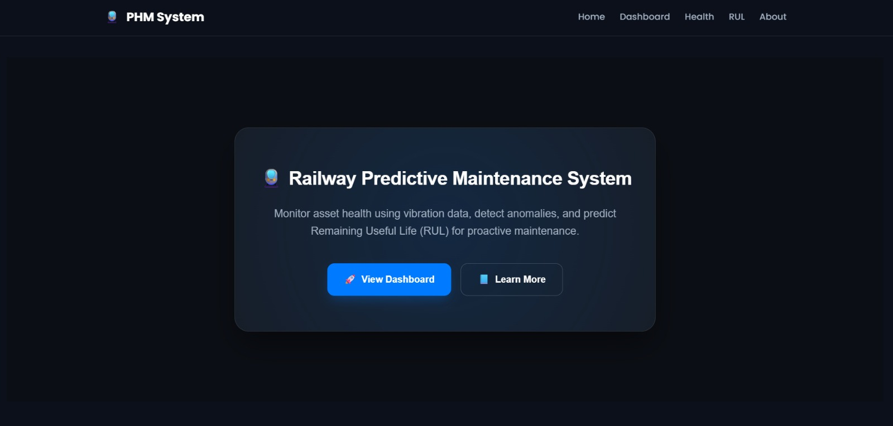
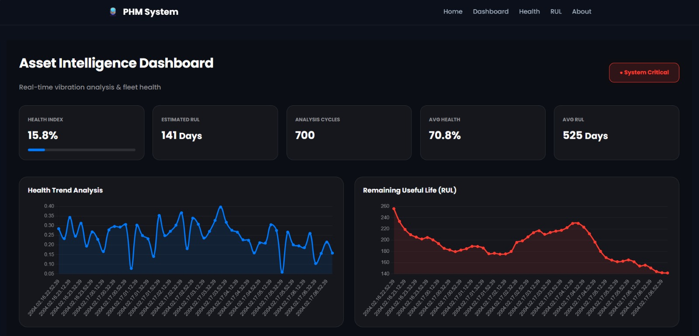
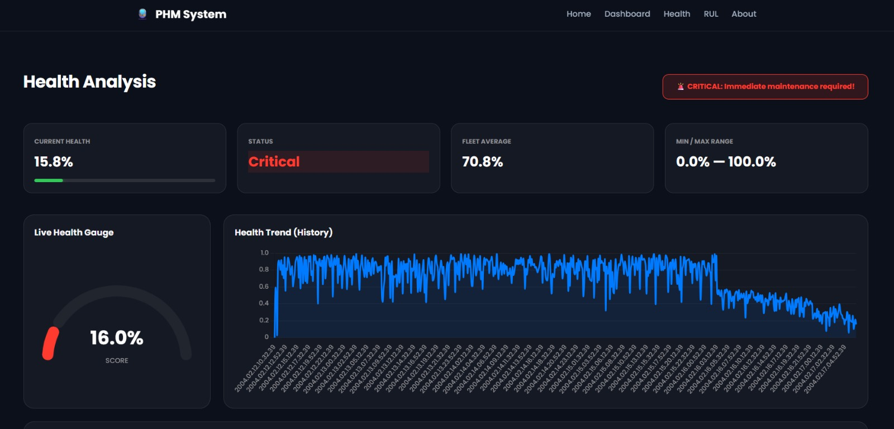
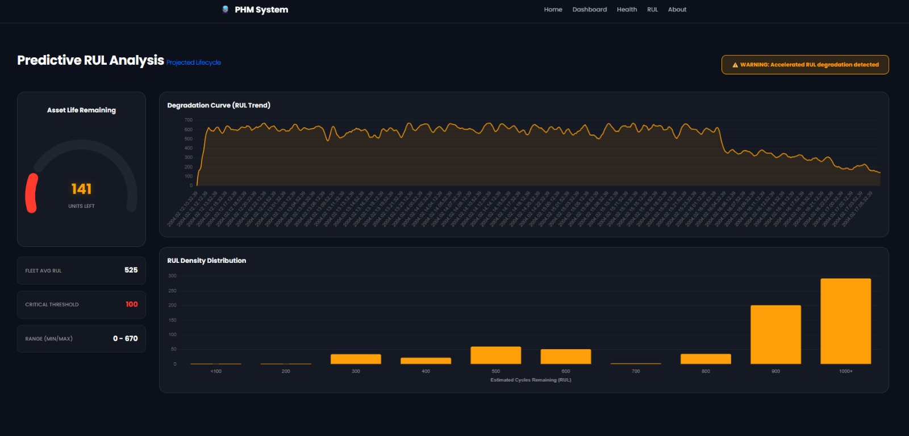

# 🚆 Real-Time Prognostics and Health Management Without Run-to-Failure Data

An Unsupervised Machine Learning Framework for Predictive Maintenance of Railway Assets


---

## 📌 Overview

Modern railway systems generate large amounts of sensor data but very little actual failure data because critical assets are maintained before complete breakdown. Traditional predictive maintenance approaches rely heavily on Run-to-Failure (RTF) datasets, which are difficult to obtain in real-world railway environments.

This project presents a **Real-Time Prognostics and Health Management (PHM) System** that monitors railway asset health using **unsupervised machine learning**. The system learns normal operating behavior from sensor data and detects anomalies without requiring historical failure records.

---

## 🎯 Problem Statement

Railway operators face several challenges:

* ❌ Lack of Run-to-Failure data
* ❌ Difficulty in predicting failures early
* ❌ High maintenance costs
* ❌ Unexpected equipment breakdowns
* ❌ Inefficient scheduled maintenance

The goal of this project is to develop a system that:

* ✅ Detects anomalies in real time
* ✅ Monitors asset health continuously
* ✅ Estimates Remaining Useful Life (RUL)
* ✅ Supports condition-based maintenance

---

## 🚀 Key Features

* 📡 Real-time sensor data monitoring
* 🤖 Unsupervised anomaly detection using Isolation Forest
* 💚 Health Index (HI) calculation
* ⏳ Remaining Useful Life (RUL) estimation
* 📊 Interactive monitoring dashboard
* 🚨 Automated maintenance alerts
* 📈 Historical trend visualization
* 💾 SQLite database integration

---

## ⚙️ System Workflow

```text
Sensor Data
      ↓
Data Preprocessing
      ↓
Feature Extraction
      ↓
Isolation Forest Model
      ↓
Anomaly Detection
      ↓
Health Index Calculation
      ↓
RUL Estimation
      ↓
Alert Generation & Visualization
```

---

## 🧠 Machine Learning Approach

### 🔍 Isolation Forest

The project uses the Isolation Forest algorithm to model healthy operating conditions and identify abnormal behavior.

Key advantages:

* Works without labeled failure data
* Effective for anomaly detection
* Suitable for highly imbalanced datasets
* Enables early fault identification

---

### 💚 Health Index (HI)

Anomaly scores are transformed into a normalized Health Index.

| Health Index | Asset Condition         |
| ------------ | ----------------------- |
| 90 – 100     | 🟢 Healthy              |
| 60 – 89      | 🟡 Moderate Degradation |
| Below 60     | 🔴 Maintenance Required |

---

### ⏳ Remaining Useful Life (RUL)

The system analyzes Health Index degradation trends over time and estimates the remaining operational life of the asset, enabling proactive maintenance planning.

---

## 🛠️ Technology Stack

| Category             | Technologies          |
| -------------------- | --------------------- |
| Programming Language | Python                |
| Machine Learning     | Scikit-Learn          |
| Algorithm            | Isolation Forest      |
| Data Processing      | Pandas, NumPy         |
| Visualization        | Matplotlib            |
| Backend              | Flask                 |
| Frontend             | HTML, CSS, JavaScript |
| Database             | SQLite                |

---

## 📊 Dataset

### NASA Bearing Dataset

The project utilizes bearing vibration data commonly used in Prognostics and Health Management research.

Dataset Characteristics:

* 📈 Time-series vibration signals
* 🔧 Bearing degradation patterns
* 📡 Suitable for anomaly detection
* ⏳ Supports Remaining Useful Life estimation

---

## 📂 Project Structure

```text
Real-Time-PHM/

├── data/
│   └── Bearing dataset/
│
├── database/
│
├── models/
│
├── outputs/
│   ├── homepage.png
│   ├── dashboard.png
│   ├── health_index.png
│   └── rul_prediction.png
│
├── src/
│
├── static/
│   └── css/
│
├── templates/
│
├── app.py
├── README.md
└── .gitignore
```

---

# 🖼️ Project Outputs

## 🏠 Home Page



---

## 📊 Dashboard Module



---

## 💚 Health Monitoring Module



---

## ⏳ Remaining Useful Life Prediction



---

## 📈 Results

The developed framework successfully:

* ✅ Detects anomalies without requiring failure labels
* ✅ Learns normal behavior using healthy operational data
* ✅ Generates alerts when abnormal conditions occur
* ✅ Tracks asset health continuously
* ✅ Estimates Remaining Useful Life (RUL)
* ✅ Supports predictive maintenance planning

---

## 🌍 Applications

* 🚆 Railway Asset Monitoring
* 🏭 Industrial Equipment Monitoring
* ⚙️ Predictive Maintenance Systems
* 📡 Condition-Based Monitoring
* 🔧 Smart Infrastructure Management

---

## 🔮 Future Enhancements

* Multi-sensor data integration
* IoT-enabled deployment
* Edge computing support
* Explainable AI (XAI)
* Deep learning-based RUL prediction
* Integration with maintenance management systems

---

## 👥 Project Team

* C. Arthi Reddy
* D. Rushindra
* T. Spoorthi

### Guided By

**Mr. V. Praveen Goud**
Assistant Professor
Department of Computer Science and Engineering
CVR College of Engineering

---

⭐ This project demonstrates how unsupervised machine learning can enable predictive maintenance and health monitoring of railway assets without relying on historical Run-to-Failure data.
